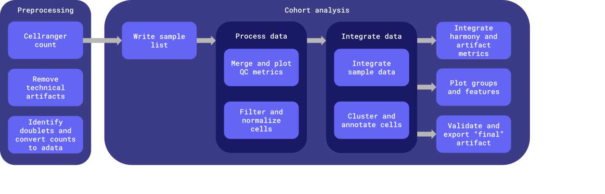

# scVI analysis Pipeline python scripts

## _PREPROCESSING_
- _pre-preprocessing_: executed by wdl [`cellbender :: remove_technical_artifacts`](../../../workflows/preprocess/preprocess.wdl#L327-L350)
- _doublet detection_ + _qc metrics_: [`prep_metadata.py`](./main/prep_metadata.py), calculates `scrublet` metrics and adds additional metrics to metadata.

## _PROCESS DATA_
- _merge and plot QC_: [`merge_and_plot_qc.py`](./main/merge_and_plot_qc.py)
    - Merges adatas.
    - plot general QC metrics for all cells
    - Save initial metadata 

- _filtering_: QC filtering [`filter.py`](./main/filter.py)

- _processing_: [`process.py`](./main/process.py)
    - Normalize + feature selection (i.e. identification of highly variable genes).
    - add PCA

## _INTEGRATE DATA_

- _integration_: [`integrate_scvi.py`](./main/integrate_scvi.py)
    - `scVI` integration to remove batch effects (minimize non-biological variability)

- _clustering_: `umap` ([`clustering_umap.py`](./main/clustering_umap.py))
    - updated to do leiden at 4 resolutions - [0.05, 0.1, 0.2, 0.4]
    - In the future we may choose `mde` (`clustering_mde.py`) over `umap`, as it is super fast and efficient on a GPU, and the embeddings are only useful for visualization so the choice is semi-arbitrary.

- _annotation_: [`annotate_cells.py`](./main/annotate_cells.py).  
    - Use cellassign and a list of marker genes. Currently using CARD cortical list of genes.  NOTE: this is not annotating the "clusters" but the cells based on marker gene expression.

- _alternate integration_: [`add_harmony.py`](./main/add_harmony.py)
    - Add and Harmony integration obsm
    - Save final metadata

- _`SCIB` METRICS_: integration metrics [`artifact_metrics.py`](./main/artifact_metrics.py)
    - Compute `scib` metrics on final artifacts and generate a report to assess quality of batch correction vs. preservation of biological variability.

## _PLOTTING_
- [`plot_feats_and_groups.py`](./main/plot_feats_and_groups.py).  
    - features: 'n_genes_by_counts', 'total_counts', 'pct_counts_mt', 'pct_counts_rb', 'doublet_score','S_score','G2M_score'
    - groups: "sample", "batch", "cell_type"

